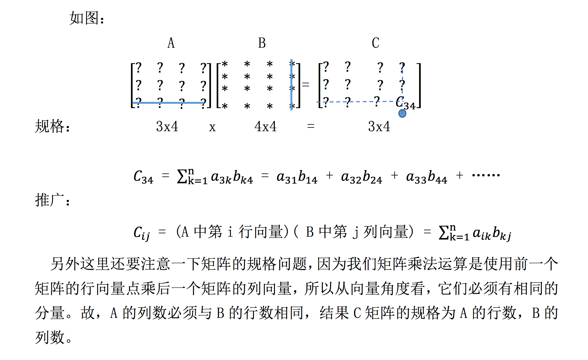
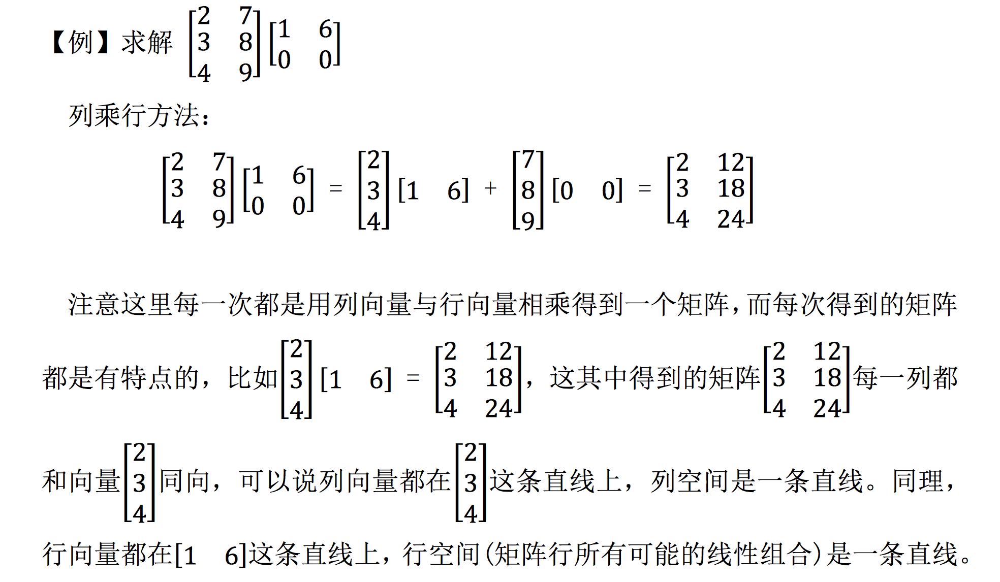
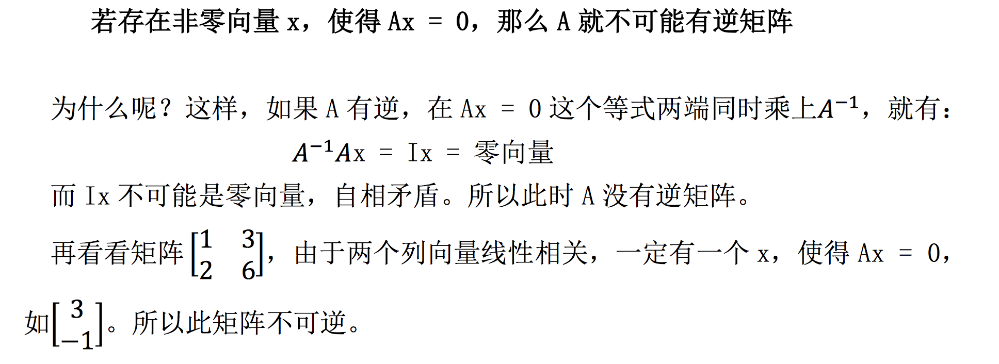
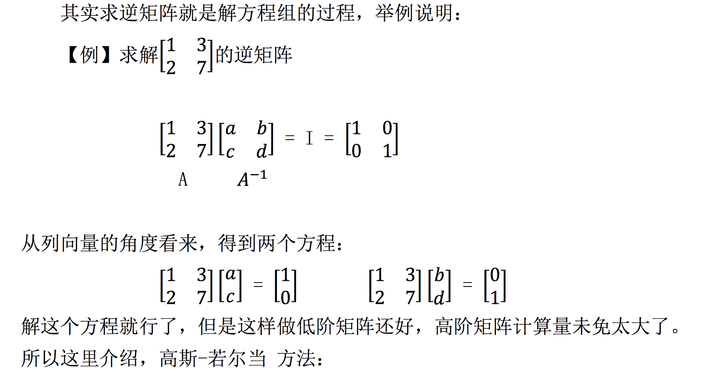

# 03-乘法和逆矩阵

## 1、Overview（概述）

前面介绍了向量和矩阵的乘法，这一节我们要介绍一下两个矩阵之间的乘法。并讨论逆矩阵存在的条件。最后再介绍求解逆矩阵的方法。

## 2、矩阵乘法

### 2.1、矩阵乘法最常见的求解方式

### 2.2、列组合与行组合方式

#### 2.2.1、列组合

还记得在 【[02-矩阵消元](https://github.com/chenyyx/notes-linear-algebra/blob/master/02-%E7%9F%A9%E9%98%B5%E6%B6%88%E5%85%83/02-%E7%9F%A9%E9%98%B5%E6%B6%88%E5%85%83.md)】中学过的 矩阵与列向量的乘积，得到一个列向量，如下: 

#### 2.2.2、行组合

同样,按照形式，这次将矩阵 A 看做行向量组合就行了: 

### 2.3、列乘以行

### 2.4、分块做乘法

分块乘法就是宏观上的矩阵乘法，比如现在有一个 50 * 50 的矩阵与 50 * 50 矩阵相乘，一个一个进行运算很麻烦，尤其是如果矩阵在某一区域上有一定的性质， 那么我们可以将其分块，如：

## 3、逆矩阵

### 3.1、逆矩阵介绍

### 3.2、逆矩阵求解

#### 3.2.1、高斯-若尔当方法

接下来，我们论证一下它的合理性: 

## 4、小结

在这个章节中，我们从不同的角度认识了矩阵的乘法，并介绍了逆矩阵的相关知识以及如何求解逆矩阵。

这个章节的内容很好地体现了线性代数这门课的优点之一: 少有繁琐的证明，更多的理解与类比。多多从向量、空间、线性组合的角度去认识矩阵之间的运算，这才是线性代数这门课的核心之一。